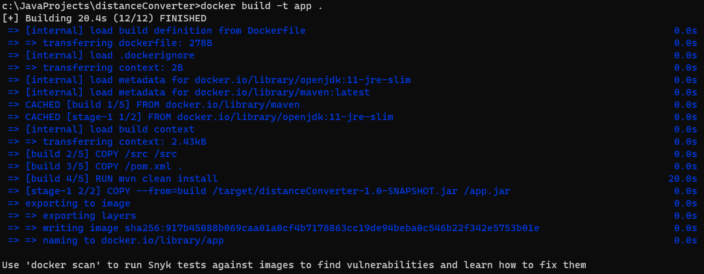
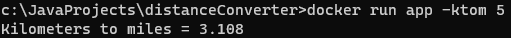
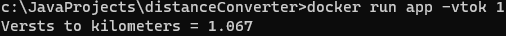
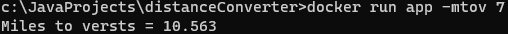

# distanceConverter
Converter units of measurement of length
## How to use
Clone repository
> git clone https://github.com/GSDTR/distanceConverter.git

Cd working dir
> cd distanceConverter

Build image
> docker build -t app .

Run application
> docker run app (-ktom | -mtok | -vtok | -ktov | -mtov | -vtom) number

